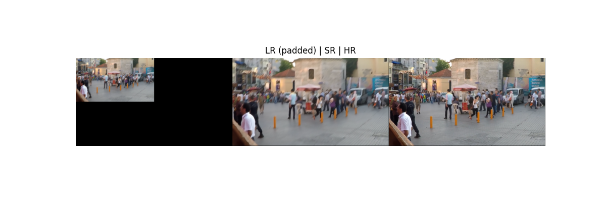

# Image Restoration with DnCNN and NAFNet

This project explores deep learning models for restoring blurry low-resolution images. It compares a custom DnCNN-based super-resolution model with a transformer-style NAFNet architecture. Both were implemented and evaluated on the GOPRO and RealBlur-R datasets using Colab Pro (A100 GPU).

---

## 🚀 Highlights

* 🧠 **DnCNN-SR**: Residual CNN + PixelShuffle-based upsampling
* 🔬 **NAFNet**: Transformer-inspired architecture (implemented, not used for demo)
* 🎯 Metrics: PSNR, SSIM, LPIPS
* 🧪 Losses: MSE, perceptual (VGG), LPIPS
* ⚙️ Training: AMP, early stopping, ReduceLROnPlateau
* 📷 Output visualization and metric summary

---

## 📊 Performance Comparison

| Model                | PSNR (↑)  | SSIM (↑)   | LPIPS (↓)  |
| -------------------- | --------- | ---------- | ---------- |
| **DnCNN (demo)**     | **26.80** | **0.8020** | **0.2313** |
| NAFNet (implemented) | 26.73     | 0.8002     | 0.2377     |
| Joint model          | 24.63     | 0.8670     | N/A        |

> DnCNN showed the best perceptual and numerical performance. NAFNet was successfully implemented but not used in the final visualization due to training instability.

---

## 🖼️ Visual Output



> Left: LR (padded) | Center: SR (DnCNN) | Right: HR
> PSNR: 26.80 | SSIM: 0.8020 | LPIPS: 0.2313

---

## 💡 Reflection: Why Simple Beats Complex

We originally tried this cascade:

> DnCNN → UNet → EDSR

While promising in theory, this chain:

* Suffered from compounding artifacts
* Was harder to converge
* Did not outperform DnCNN alone in PSNR/SSIM/LPIPS

📌 **Conclusion**: well-designed single models + quality upsampling outperform deep cascades in image restoration.

---

## 📁 Project Structure

```
image-restoration/
├── demo.ipynb              # Run DnCNN on test images (quick start)
├── dncnn_sr.ipynb          # Full DnCNN model training + results
├── nafnet.ipynb            # Full NAFNet implementation + training (optional)
├── old_joint_model_code/   # Original full pipeline code archive
├── results/                # Output samples + originals + result visualizations + metrics_results
├── README.md               # You're reading it
└── requirements.txt
```

---

## 📄 Datasets

* [GOPRO\_Large Dataset](https://seungjunnah.github.io/Datasets/gopro)
* [RealBlur-R Dataset](https://cg.postech.ac.kr/research/realblur/)

---

## 🔗 DnCNN Model Weights

You can download pretrained DnCNN weights here:
[Google Drive](https://drive.google.com/file/d/1kX9MaNp3m8B5XAwCfqo9yrXwHhyAEpwP/view?usp=sharing)

---

## 🛠️ Setup

```bash
pip install -r requirements.txt
```

Then launch `demo.ipynb` to run DnCNN on your own input images.

>  This repo includes a pretrained model and demo script. You do not need to train anything to test results.

---

## 🔧 Requirements

* torch
* torchvision
* lpips
* tqdm
* matplotlib
* scikit-image
* opencv-python

---

## 📬 Contact

Maintained by [Hank Song](https://github.com/HANKSOONG)
For questions, feel free to open an issue or reach out.
